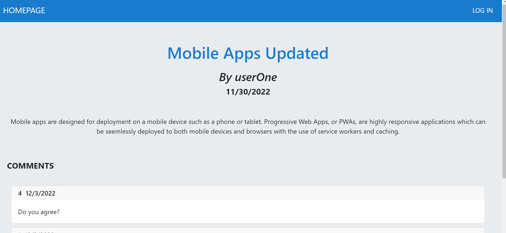

# Week 14: CMS Blog

## Description

This repository is where I create code for a CMS-style blog app.

## Installation

N/A

## Usage

Open the webpage to view the CMS Blog app. Existing blog posts will appear on the home page. Log into the app to access the dashboard, with a list of your own blog posts. Click into a blog post to view the post content and any comments. You can add, edit or delete your own comments with the relevant buttons. If the blog post is your own, you can also edit or delete the post.

Link to deployed app: (https://bechedley-blog.herokuapp.com/)

## Credits

The following resources were referenced to ensure best practice and adherence to appropriate conventions:

SQL Data Types for MySQL, SQL Server, and MS Access by W3 Schools: (https://www.w3schools.com/sql/sql_datatypes.asp)

Bootstrap CSS Framework: (https://getbootstrap.com/)
Bootstrap Documentation: (https://getbootstrap.com/docs/5.2/getting-started/introduction/)

Sequelize Documentation: (https://sequelize.org/docs/v6/advanced-association-concepts/advanced-many-to-many/)

ConnectSessionStore Documentation: (https://www.npmjs.com/package/connect-session-sequelize)

Express-session Documentation: (https://www.npmjs.com/package/express-session)

Bcrypt Documentation: (https://www.npmjs.com/package/bcrypt)

Dotenv Documentation: (https://www.npmjs.com/package/dotenv)

Handlebars Documentation on Built-in Helpers: (https://handlebarsjs.com/guide/builtin-helpers.html#if)
Stack Overflow: Handlebarsjs check if a string is equal to a value, answers by nwxdev and Mihail (https://stackoverflow.com/questions/34252817/handlebarsjs-check-if-a-string-is-equal-to-a-value) 

Common js functions and parameters, for loops and arrays: JS CheatSheet by HTML CheatSheet (https://htmlcheatsheet.com/js/)

## License

Licensed under the standard MIT license. Please refer to the license in the repo for more information.
